# rent calculator

# Goal for this project 

rent calculator should be able to help owner of the flat to decide how much is a correct amount to ask for.

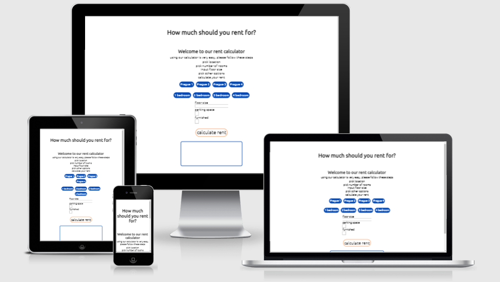

#### updated design

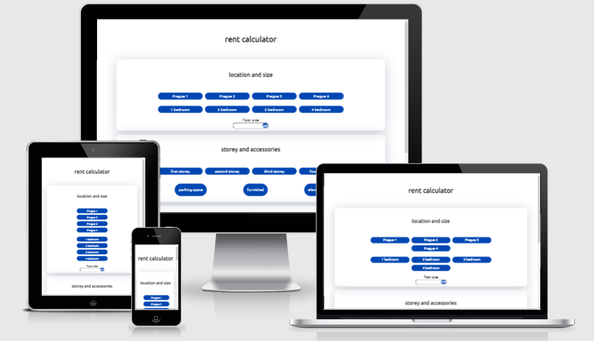

# Table of Contents

## User Goals
* Visually appealing, not cluttered with information or images.
* Easily navigate through.
* Medium standard of difficulty for the questions.
* Rating on performance.

## Site owners Goals
* Create an easily navigated site using a single page format.
* Create a visually appealing site through the choice of colours and layout.

### Requirements
* Responsive design, based on mobile-first.
* Use single-page layout.
* Give a positive user experience through colours and layout.

### Expectations
* I expect user to process as smooth as possible.
* I expect user to be done in under 30s wit the whole process.
* I expect screen size not to affect the quality of my experience.

## Design Choices

### Fonts

I have used [Google Fonts](https://fonts.google.com/ "Google Fonts") to aid me in selecting a suitable font. To keep the font for this game to a clean and simple look, I have chosen [Unbutu](https://fonts.google.com/specimen/Ubuntu). This is the only one that I will use as I don't feel there is enough content involved to warrant complicating the look with different fonts for headers and text.

### Icons

I will use some icons to enhance the user experience for the choice of categories, they will not be stand-alone but there to accompany the text and break up the look of all text. The icons will be sourced from the [Font Awesome library](https://fontawesome.com/ "Font Awesome"). 

At the End, I didnt use any, I felt any icon was breaking my idea of clean design.

### Colors

To create the colour scheme for the page, I used [W3schools](https://www.w3schools.com/colors/colors_picker.asp). I  I decided that as this was not a complex project where lots of different colours were needed, I would only use two. The colour scheme can be seen here . 

### Structure

I will be building my website with a mobile-first approach. Using the Chrome developer tools to give me the iPhone 5/SE (320px), I will use this as the smallest screen size for styling.

### Features

This a small projcet with limited functionalities and only one page. I started with a mobile phone version and worked my way up. In most of my styling I used flexbox, where I started with column for mobile version and changed to row at 375px and 768px respectively.  

Standard button is blue
* standard button - was created with a goal of very simplistic design without borders and with text only, with border-radius of 5em 

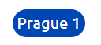.

active button, when a button is clicked and being active, color turns orange - the idea was to let user know which button was pressed by a different color
* active button 

.

* floor size - input - this element was changed to more visually appealing version using border-radius of 5em and a span with border radius of 50% and bolder text, arrows are hidden - can be seen here

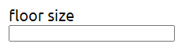.

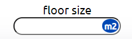.

* parking and furnished buttons - first intent was to leave checkboxes visible and style only to appear a bit bigger, this was later changed to create one simplistic design thru the whole site, using display: none - checkobex became non visible for the user and lables were styled to a point to make them look similar to a button with blue color and with border-radius of 5em. Later, using pseudo elemnt:checked an orange color was added when "active". Newer version can be seen below.

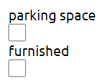.

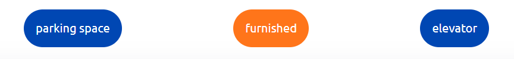.

* result buttons - this button, when clicked enables the process to estimate a rent for the user, when hovered- turns orange - this was later changed to have an orange color originaly and when hovered to turn little bit darker and grow in size with the aim of more visually appealing design.

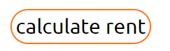.

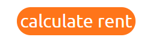.

because of contrast issues with, answer button was changed to the version seen below

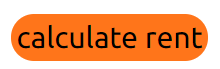.

this area shows result, estimated rent, when page loads, shows nothing, styled with only font size border and border-radius of 1em. The aim was to create area with empty field.
* price area

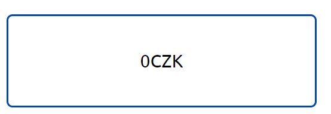.

### Techonologies used

#### Languages
* HTML
* CSS
* JavaScript

#### Libraries
* google fonts library

#### tools
* for construction - Visual Studio Code
* for deployment - netlify - thanks to help of my mentor I changed deployment to Github
* for HTML validation - W3C HTML validation service
* for CSS validation - W3C CSS validation service
 
### Features to be implemented

* floor number - this feature was later added on
* maintenance cost
* cardinal direction
* balcony
* state of the flat
* result button working on "keypress"

### Testing

* lighthouse - first test shown missing meta description which was fixed- both results shown below

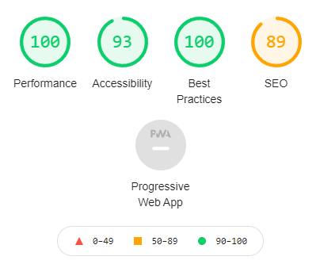.

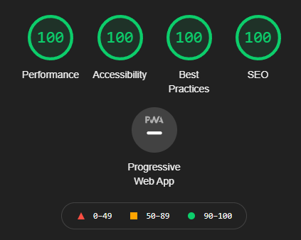.

* W3C validator - HTML validation - with first test the page had one issue and that was a missing heading which was fixed both results shown below

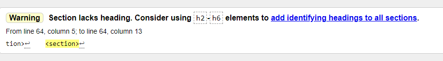.

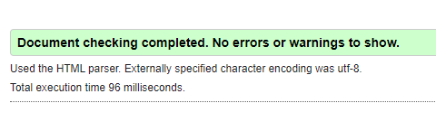.

*W3C validator - CSS validation - first test shown no issues - result shown below

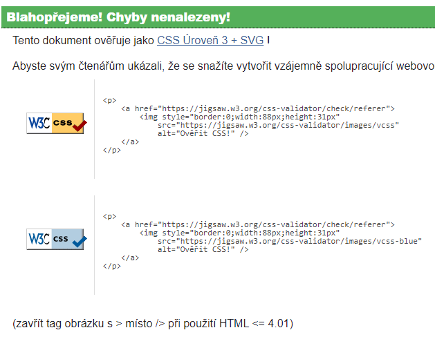.

After implementing my inital idea of calculating price by square meter I realized I have to adjust prices per square meter to make sure calculator does more realistic pricing. Overall Iam realizing this approach has quite a number of flaws and will have to be rethinked to for realisitc use in a real world. Even tho I implemented another features to create a better calculator, there is still some work to do. People who tested calculator didnt have any issues understanding or navigating thru the calculator. It was suggested to me to add some pictures. I wanted to keep the design with white background and thats what I did. 

### Deployment

This project was deployed via GitHub by executing the following steps.
After writing the code, committing and pushing it to GitHub:

1. Navigate to the repository on github and click **Settings**.
1. From there, go to the **Source section** within the Github Pages section.
1. Select **main branch** on the dropdown menu, and click save.
1. Now the website is live on **https://jjohnyy.github.io/rent-calculator/**
1. Any time commits and pushes are sent to Github, the Github Pages site should update shortly after.

### JavaScript

With this being my first project using javascript, naturally, I encoutered some issues that I had to work throught.

One of my major headeches was getting correct value to each button. I lost many hours attemting to work this out. Eventually, my mentor and tutor had to help me out. I was able to work it out and understand how to work with objects and arrays. This is part where I learned more advanced way to iterate thru array than for loop.

When I ran test of the calculator, I quickly realized that I have to implement more variables and choices. So another row of buttons was added and function created to calculate another variable. I also added at this point another checkbox with the same thoughts as I had before. This finally made me feel as the calculator could work as intended. 

Another issue I encoutered was to create "active"(highlited wit horange color) - buttons with different color. I was, for a long time able to select them all, or none of them. With help of w3c schools - website, I was able to create a function which worked well and only one button was "active" when selected. Then I encoutered another issue and that only ONE button on entire page could be "active". This was solved by renaming active class and applying to other functions. 

After creating appliances() - if else function, which worked well, I added another option. This is where I encoutered another problem and learned what has to be added to else if statements to make this funcion work without any issues. 

Later on, as was suggested my mentor, I moved all variables and constants to top of the script. 

### Known issues

* result button working only on click and not on keypress
* calculating price by square meter and changing between bedrooms sometimes creates unrealistic results

### Acknowledgements

First of all, I would like to thank my mentor Simen ([Eventyret_mentor](https://github.com/Eventyret)) for guiding me throughout this project. 
He helped me to brainstorm about ideas which were in line with my interests. 
During the mid review, he gave me a lot of tips in order to improve my code and to implement some other features in order to make my website more user friendly.

I want to thank our Slack community as well. Whenever I had a doubt, I did some research on Slack and I always found someone who has the same issue as I did. 
This helped me a lot to get to the solution sooner.

My inspirsation I got mostly from working in rent business. Would love to continue working on this project to apply it at my company as I feel there are some people who would benefit from it. 

