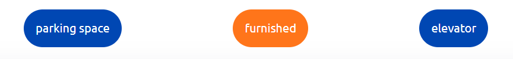
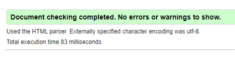

# rent calculator

# Goal for this project 

rent calculator should be able to help owner of the flat to decide how much is a correct amount to ask for.

# Table of Contents

## User Goals
* Visually appealing, not cluttered with information or images.
* Easily navigate through.
* Medium standard of difficulty for the questions.
* Rating on performance.

## Site owners Goals
* Create an easily navigated site using a single page format.
* Create a visually appealing site through the choice of colours and layout.

### Requirements
* Responsive design, based on mobile-first.
* Use single-page layout.
* Give a positive user experience through colours and layout.

### Expectations
* I expect user to process as smooth as possible.
* I expect user to be done in under 30s wit the whole process.
* I expect screen size not to affect the quality of my experience.

## Design Choices

### Fonts

I have used [Google Fonts](https://fonts.google.com/ "Google Fonts") to aid me in selecting a suitable font. To keep the font for this game to a clean and simple look, I have chosen [Unbutu](https://fonts.google.com/specimen/Ubuntu). This is the only one that I will use as I don't feel there is enough content involved to warrant complicating the look with different fonts for headers and text.

### Icons

I will use some icons to enhance the user experience for the choice of categories, they will not be stand-alone but there to accompany the text and break up the look of all text. The icons will be sourced from the [Font Awesome library](https://fontawesome.com/ "Font Awesome"). 

### Colours

To create the colour scheme for the page, I used [W3schools](https://www.w3schools.com/colors/colors_picker.asp). I  I decided that as this was not a complex project where lots of different colours were needed, I would only use two. The colour scheme can be seen here . 

### Structure

I will be building my website with a mobile-first approach. Using the Chrome developer tools to give me the iPhone 5/SE (320px), I will use this as the smallest screen size for styling.

### Features

This a small projcet with limited functionalities and only one page. I started with a mobile phone version and worked my way up. In most of my styling I used flexbox, where I started with column for mobile version and changed to row at 375px and 768px respectively.  

Standard button is blue
* standard button - was created with a goal of very simplistic design without borders and with text only, with border-radius of 5em 

.

active button, when a button is clicked and being active, color turns orange
* active button

.

* floor size - input - this element was changed to more visually appealing version using border-radius of 5em and a span with border radius of 50% and bolder text - can be seen here

.

.

* parking and furnished buttons - first intent was to leave checkboxes visible and style only to appear a bit bigger, this was later changed to create one simplistic design thru the whole site, using display: none - checkobex became non visible for the user and lables were styled to a point to make them look similar to a button with blue color and with border-radius of 5em. Later, using pseudo elemnt:checked an orange color was added when "active". Newer version can be seen below.

.

.

* result buttons - this button, when clicked enables the process to estimate a rent for the user, when hovered- turns orange - this was later changed to have an orange color originaly and when hovered to turn little bit darker and grow in size with the aim of more visually appealing design.

.

this area shows result, estimated rent, when page loads, shows nothing, styled with only font size border and border-radius of 1em. The aim was to create area with empty field.
* price area

.

### Techonologies used

#### Languages
* HTML
* CSS
* JavaScript

#### Libraries
* google fonts library

#### tools
* for construction - Visual Studio Code
* for deployment - netlify - thanks to help of my mentor I changed deployment to Github
* for HTML validation - W3C HTML validation service
* for CSS validation - W3C CSS validation service
 
### Features to be implemented

* floor number - this feature was later added on
* maintenance cost
* cardinal direction
* balcony
* state of the flat

### Testing

* lighthouse - first test shown missing meta description which was fixed- both results shown below

.

.

* W3C validator - HTML validation - with first test the page had one issue and that was a missing heading which was fixed both results shown below

.

.

*W3C validator - CSS validation - first test shown no issues - result shown below

.

After implementing my inital idea of calculating price by square meter I realized I have to adjust prices per square meter to make sure calculator does more realistic pricing. Overall Iam realizing this approach has quite a number of flaws and will have to be rethinked to for realisitc use in a real world. Even tho I implemented another features to create a better calculator, there is still some work to do. 

### Deployment

This project was deployed via GitHub by executing the following steps.
After writing the code, committing and pushing it to GitHub:

1. Navigate to the repository on github and click **Settings**.
1. From there, go to the **Source section** within the Github Pages section.
1. Select **main branch** on the dropdown menu, and click save.
1. Now the website is live on **https://jjohnyy.github.io/rent-calculator/**
1. Any time commits and pushes are sent to Github, the Github Pages site should update shortly after.

