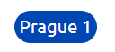

# rent calculator

# Goal for this project 

rent calculator should be able to help owner of the flat to decide how much is a correct amount to ask for. This

# Table of Contents

## User Goals
* Visually appealing, not cluttered with information or images.
* Easily navigate through.
* Medium standard of difficulty for the questions.
* Rating on performance.

## User Stories
* As a user, I want to have the site personalised to my username.
* As a user, I want to have clear options for the categories to choose from.
* As a user, I want to see my score progress during a quiz category.
* As a user, I want to see my rating based on my score after completing a category. 
* As a user, I want to exit out of a set of category questions and back to the main selection page.

## Site owners Goals
* Create an easily navigated site using a single page format.
* Create a visually appealing site through the choice of colours and layout.

### Requirements
* Responsive design, based on mobile-first.
* Use single-page layout.
* Give a positive user experience through colours and layout.

### Expectations
* I expect user to process as smooth as possible.
* I expect user to be done in under 30s wit the whole process.
* I expect screen size not to affect the quality of my experience.

## Design Choices

### Fonts

I have used [Google Fonts](https://fonts.google.com/ "Google Fonts") to aid me in selecting a suitable font. To keep the font for this game to a clean and simple look, I have chosen [Unbutu](https://fonts.google.com/specimen/Ubuntu). This is the only one that I will use as I don't feel there is enough content involved to warrant complicating the look with different fonts for headers and text.

### Icons

I will use some icons to enhance the user experience for the choice of categories, they will not be stand-alone but there to accompany the text and break up the look of all text. The icons will be sourced from the [Font Awesome library](https://fontawesome.com/ "Font Awesome"). 

### Colours

To create the colour scheme for the page, I used [W3schools](https://www.w3schools.com/colors/colors_picker.asp). I  I decided that as this was not a complex project where lots of different colours were needed, I would only use two. The colour scheme can be seen here . 

### Structure

I will be building my website with a mobile-first approach. Using the Chrome developer tools to give me the iPhone 5/SE (320px), I will use this as the smallest screen size for styling.

### Features

This a small projcet with limited functionalities and only one page.

Standard button is blue
* standard button

.

active button is orange
* active button

